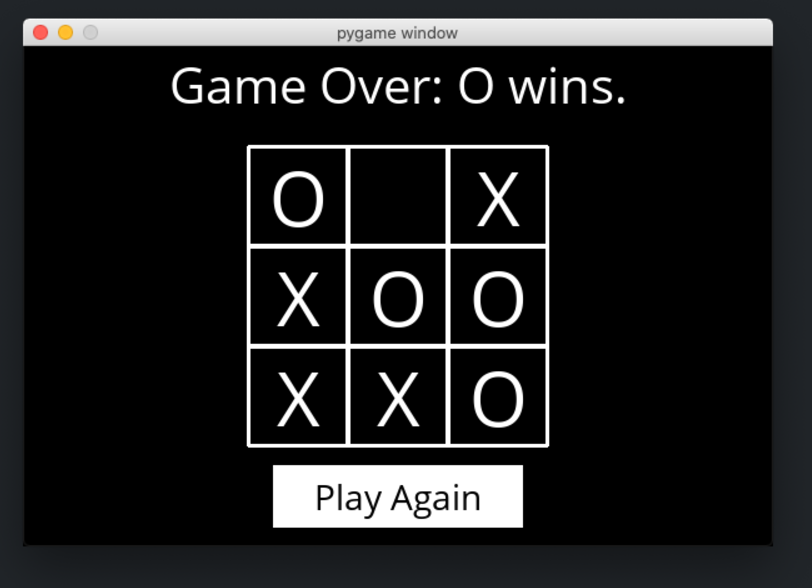

Using Minimax, implement an AI to play Tic-Tac-Toe optimally.

There are two main files in this project: runner.py and tictactoe.py. tictactoe.py contains all of the logic for playing the game and making optimal moves. runner.py has been implemented for you and includes all of the code to run the game's graphical interface. 
